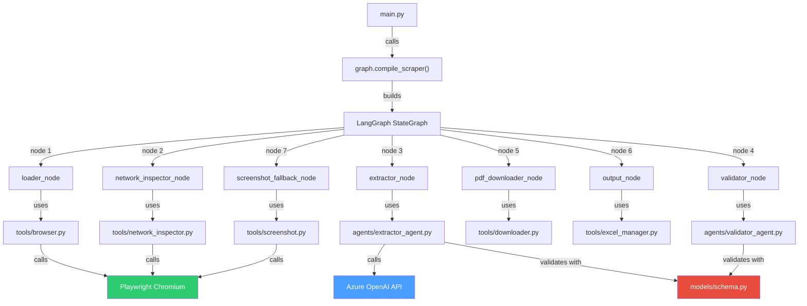

# 🧠 SEBI Agentic Scraper — Architecture & Flow Documentation

## Table of Contents

1. [What is an Agentic Scraper?](#what-is-an-agentic-scraper)
2. [High-Level Architecture](#high-level-architecture)
3. [The LangGraph State Machine](#the-langgraph-state-machine)
4. [Node-by-Node Walkthrough](#node-by-node-walkthrough)
5. [Self-Healing Mechanism](#self-healing-mechanism)
6. [Data Flow](#data-flow)
7. [File-by-File Reference](#file-by-file-reference)
8. [How They Wire Together](#how-they-wire-together)

---

## What is an Agentic Scraper?

A traditional scraper uses hardcoded CSS selectors or XPaths:
```python
# ❌ Traditional (brittle)
soup.select("table#sample_1 tr td a.points")
```

An **agentic scraper** replaces that with an LLM that reasons about the page:
```
# ✅ Agentic (resilient)
"Here is the HTML. Find all announcements and extract title + date."
```

The LLM understands **semantics**, not selectors. If SEBI redesigns their page tomorrow — 
new class names, different layout, table → cards — the LLM adapts automatically.

---

## High-Level Architecture

```
┌─────────────────────────────────────────────────────────────────────┐
│                         main.py (CLI)                               │
│  Sets up logging, validates API key, invokes the LangGraph pipeline │
└────────────────────────────────┬────────────────────────────────────┘
                                 │
                                 ▼
┌─────────────────────────────────────────────────────────────────────┐
│                        graph.py (LangGraph)                         │
│  Orchestrates the pipeline as a state machine with 7 nodes          │
│                                                                     │
│  ┌──────────┐  ┌───────────────┐  ┌───────────┐  ┌───────────┐     │
│  │  Loader   │→│   Network     │→│ Extractor  │→│ Validator  │     │
│  │  Node     │  │  Inspector   │  │   Node     │  │   Node     │     │
│  └──────────┘  └───────────────┘  └─────┬─────┘  └─────┬─────┘     │
│                                         │               │           │
│                                    [retry/fallback]     ▼           │
│                                         │         ┌────────────┐    │
│                                         └────────→│ Downloader │    │
│                                                   │   Node     │    │
│                                                   └─────┬──────┘    │
│                                                         ▼           │
│                                                   ┌──────────┐      │
│                                                   │  Output  │      │
│                                                   │   Node   │      │
│                                                   └──────────┘      │
└─────────────────────────────────────────────────────────────────────┘
          │                    │                    │
          ▼                    ▼                    ▼
   tools/browser.py    agents/extractor_agent.py   agents/validator_agent.py
   tools/network_inspector.py                      models/schema.py
   tools/screenshot.py
```

---

## The LangGraph State Machine

The core of the system is a **LangGraph `StateGraph`** — a directed graph where:
- **Nodes** are async Python functions that perform one step of the pipeline
- **Edges** connect nodes (linear or conditional)
- **State** is a Pydantic model shared across all nodes

### State Object (`ScraperState`)

Every node reads from and writes to this shared state:

```python
class ScraperState(BaseModel):
    url: str                              # Target URL
    html: Optional[str]                   # Raw page HTML (from Loader)
    network_result: Optional[dict]        # API discovery results (from Network Inspector)
    extraction_result: Optional[dict]     # Raw extracted data (from Extractor)
    validated_announcements: list[dict]   # Clean data (from Validator)
    validation_stats: Optional[dict]      # Quality metrics
    retry_count: int                      # How many retries so far
    errors: list[str]                     # Accumulated errors
    strategy_used: str                    # Which extraction strategy succeeded
    screenshot_b64: Optional[str]         # Screenshot for Vision fallback
    output_path: Optional[str]            # Where JSON was saved
```

### Graph Topology

```
START → loader → network_inspector → extractor → [DECISION]
                                                      │
                                         ┌────────────┼────────────┐
                                         ▼            ▼            ▼
                                     validator   retry_extract   screenshot_fallback
                                         │            │            │
                                         ▼            │       [DECISION]
                                      output          │        ┌──┴──┐
                                         │            │        ▼     ▼
                                        END           └→ extractor  validator
```

The **conditional edges** implement intelligence:
- If extraction succeeds → proceed to validator
- If extraction fails (attempt 1) → retry with a refined prompt
- If extraction fails (attempt 2+) → try screenshot + Vision LLM
- If max retries exceeded → proceed with whatever we have

---

## Node-by-Node Walkthrough

### Node 1: Loader (`loader_node`)
**File:** `tools/browser.py`  
**Purpose:** Get the full rendered HTML of the SEBI page

```
Input:  state.url
Output: state.html (157,965 characters)
```

**How it works:**
1. Launches a headless Chromium browser via **Playwright**
2. Navigates to the SEBI URL
3. Waits for `networkidle` (all XHR/fetch requests complete)
4. Waits an extra 2 seconds for any late JS rendering
5. Returns `page.content()` — the full rendered DOM

**Resilience:** Retries up to 3 times with configurable delay on failure.

---

### Node 2: Network Inspector (`network_inspector_node`)
**File:** `tools/network_inspector.py`  
**Purpose:** Check if SEBI exposes a hidden JSON API

```
Input:  state.url
Output: state.network_result = { found_json_api: bool, api_url, api_response_body }
```

**How it works:**
1. Opens the page in a fresh browser
2. Hooks into Playwright's `page.on("response")` event
3. Captures every XHR/fetch response
4. For each JSON response, checks if it looks like announcement data using heuristics:
   - Is it a list of objects?
   - Do the objects have title-like keys? (`title`, `name`, `subject`)
   - Do the objects have date-like keys? (`date`, `issue_date`)
5. If found → the Extractor can skip the LLM entirely

**On the SEBI site:** No JSON API is detected (the page uses server-rendered HTML), so this returns `found_json_api: False`.

---

### Node 3: Extractor (`extractor_node`)
**File:** `agents/extractor_agent.py`  
**Purpose:** Extract structured announcement data using the best available strategy

```
Input:  state.html, state.network_result
Output: state.extraction_result = { announcements: [...], source_strategy: str }
```

**Three strategies in priority order:**

#### Strategy A: Direct API Parsing (no LLM needed)
- If Network Inspector found a JSON API → parse it directly
- Map keys like `title` → `Announcement.title`, `date` → `Announcement.issue_date`
- Fastest path, highest confidence (0.95)

#### Strategy B: DOM + LLM Semantic Extraction (primary)
This is what actually runs on the SEBI site:

1. **HTML Cleaning** — The `_clean_html()` function:
   - Tries to extract just `<table id="sample_1">` (the announcements table)
   - Falls back to pattern matching for tables with announcement links
   - Falls back to full HTML with scripts/styles/comments stripped
   - Result: 132K HTML → 17.5K focused content

2. **LLM Call** — Sends the cleaned HTML to Azure OpenAI (`gpt-4.1-mini`):
   ```
   System: "You are a data extraction specialist..."
   User:   "Analyse this HTML. Extract title, issue_date, confidence for each entry."
   ```

3. **Structured Output** — Uses LangChain's `.with_structured_output(AnnouncementList)`:
   - The LLM is forced to return a Pydantic-compatible JSON
   - No regex parsing needed — the output is already typed

#### Strategy C: Vision LLM Fallback
- If DOM extraction fails → take a screenshot → send to Vision LLM
- Lower confidence (capped at 0.7) because OCR is less reliable
- Only triggered after retry failures

---

### Node 4: Validator (`validator_node`)
**File:** `agents/validator_agent.py`  
**Purpose:** Clean, validate, and score the extracted data

```
Input:  state.extraction_result.announcements (25 raw items)
Output: state.validated_announcements (filtered list), state.validation_stats
```

**Validation & Semantic Checks:**

| Check | Rule | Example |
|---|---|---|
| Date Window | Filters based on `WEEKS_BACK` | `WEEKS_BACK=0` → Feb 23 onward |
| Keyword Exclusion | Skips junk if title contains forbidden words | "Mutual Funds" → **Skipped** |
| Category Remapping| Remaps "SEBI" → "AIF" for specific keywords| "Portfolio Managers" → **AIF** |
| Duplicate removal | Case-insensitive title + same date = duplicate | Keeps unique items |
| Content Accuracy | Formats `IssueDate` to DD-MM-YYYY | `2026-02-27` → `27-02-2026` |

---

### Node 5: PDF Downloader (`pdf_downloader_node`)
**File:** `tools/downloader.py`
**Purpose:** Fetch the actual PDF for every validated announcement

1. Iterates through all `validated_announcements`
2. Follows the `detail_url` to find the direct PDF link
3. Calculates path using the **Remapped Category** (e.g., SEBI or AIF)
4. Downloads and saves at `.../Category/Subfolder/Year/Month/Title.pdf`
5. Ensures **Robust Overwriting**: Deletes existing PDFs before downloading

### Node 6: Output (`output_node`)
**File:** `tools/excel_manager.py`
**Purpose:** Save results to Excel and aggregated systems

1. Filters announcements to **Downloaded Only**
2. Explicitly overwrites `Searching_agent_output.xlsx` (full refresh)
3. Formats metadata exactly as required for the Akshayam ETL.

---

### Node 6: Screenshot Fallback (`screenshot_fallback_node`)
**File:** `tools/screenshot.py` + `agents/extractor_agent.py`  
**Purpose:** Last-resort extraction via Vision LLM

Only triggered if DOM+LLM extraction fails repeatedly:
1. Captures a full-page PNG screenshot via Playwright
2. Encodes as base64
3. Sends to Vision LLM with extraction instructions
4. Parses JSON from the LLM response

---

## Self-Healing Mechanism

The system has **three layers of resilience:**

### Layer 1: Retry with Refined Prompt
```
Attempt 1 fails → retry_count = 1 → extractor runs again with REFINED_PROMPT
```
The refined prompt adds hints:
- "Look for dates embedded in URLs"
- "Watch for Indian date formats (DD/MM/YYYY)"
- "Titles may span multiple lines"

### Layer 2: Screenshot + Vision Fallback
```
Attempt 2 fails → retry_count = 2 → screenshot_fallback_node
```
Takes a screenshot and sends it to a Vision-capable LLM.

### Layer 3: Graceful Degradation
```
All attempts fail → proceed to validator with empty list → output empty JSON
```
The system never crashes. It logs errors, produces whatever it can, and exits with code 2.

### Decision Logic (from `graph.py`)
```python
def should_retry_or_fallback(state):
    if announcements exist:     → "validate"
    if retry_count == 0:        → "retry_extract" (refined prompt)
    if retry_count < MAX:       → "screenshot_fallback"
    else:                       → "validate" (give up gracefully)
```

---

## Data Flow

```
                    SEBI Website
                         │
                         ▼
              ┌──────────────────┐
              │   Raw HTML       │  157,965 chars
              │   (Playwright)   │
              └────────┬─────────┘
                       │
                       ▼
              ┌──────────────────┐
              │ Network Traffic  │  6 XHR URLs captured
              │ (no API found)   │  → proceed to LLM
              └────────┬─────────┘
                       │
                       ▼
              ┌──────────────────┐
              │  Cleaned HTML    │  17,544 chars (table only)
              │  (_clean_html)   │
              └────────┬─────────┘
                       │
                       ▼
              ┌──────────────────┐
              │  Azure GPT-4.1   │  Structured output
              │  (LangChain)     │  → 25 Announcement objects
              └────────┬─────────┘
                       │
                       ▼
              ┌──────────────────┐
              │  Validation      │  25/25 passed
              │  (dedup, dates)  │  0 removed
              └────────┬─────────┘
                       │
                       ▼
              ┌──────────────────┐
              │  Output JSON     │  output/announcements.json
              │  + Table         │  + formatted stdout
              └──────────────────┘
```

---

## File-by-File Reference

### `main.py` — CLI Entrypoint
- Sets up structured logging
- Validates Azure API key
- Compiles and invokes the LangGraph pipeline
- Prints formatted results table
- Exit codes: `0` = success, `1` = partial, `2` = failure

### `graph.py` — LangGraph State Machine
- Defines `ScraperState` (shared Pydantic state)
- Defines all 6 node functions
- Defines conditional edge logic (retry/fallback decisions)
- `build_scraper_graph()` wires everything together
- `compile_scraper()` returns the runnable graph

### `config.py` — Configuration
- All settings from environment variables
- Azure OpenAI credentials, deployment names
- Browser settings (headless, timeouts)
- Retry limits, output paths, logging

### `models/schema.py` — Pydantic Models
- `Announcement` — title, issue_date, confidence
- `ExtractionResult` — list of announcements + metadata
- `AnnouncementList` — used for LLM structured output parsing

### `tools/browser.py` — Playwright Page Loader
- Async Chromium launcher with retry logic
- Configurable user agent, viewport, timeouts
- Returns rendered HTML

### `tools/network_inspector.py` — XHR/API Detection
- Hooks into Playwright response events
- Captures JSON responses from XHR/fetch calls
- Heuristic detection of announcement-like APIs

### `tools/screenshot.py` — Screenshot Capture
- Full-page screenshot via Playwright
- Base64 encoding for Vision LLM
- Saves PNG to disk as well

### `agents/extractor_agent.py` — LLM Extraction
- Three strategies: API → DOM+LLM → Vision
- Smart HTML cleaning (focuses on content tables)
- Prompt engineering for semantic extraction
- Uses AzureChatOpenAI with structured output

### `agents/validator_agent.py` — Data Quality
- Title validation (non-empty, meaningful)
- Date realism (1992 – today)
- Duplicate removal (case-insensitive)
- Confidence scoring (keyword boosts, penalties)

---

## How They Wire Together



This is a **true agentic system** — the LLM is not just a utility function, it's the
core decision-maker for data extraction. The graph orchestrates when to call it,
when to retry, and when to fall back to alternative strategies.
